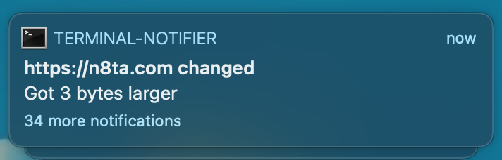

# watchttp


Watch(ttp) a list of webpages for changes at a set interval. Send system notifcations when they change.




## Config Format
Uses a config.yaml file located anywhere to hot-reload settings. Just launch watchttp as a daemon and edit the config whenever you need to.

`period_ms` is how long watchttp sleeps between loading each of your sites.
```yaml
sites:
  - https://n8ta.com
  - https://archive.org
period_ms: 3600000
```

## Crontab Installation
```shell
cargo build --release
cp ./target/release/watchttp /usr/local/bin
crontab -e
  // Add this line: (launches at boot)
  @reboot /usr/local/bin/watchttp /PATH/TO/CONFIG.YAML
```

## Dependencies
1. `yaml-rust = "0.4"` config file
2. `ureq = "2.1"` http requests
3. `notify = "5.0.0-pre.10"` & `crossbeam-channel = "0.4.0"` config file hot-reloading
4. `notify-rust = 4.0` OS notifications

## Linux Support
See the [notify-rust project readme](https://github.com/hoodie/notify-rust#linuxbsd-support)